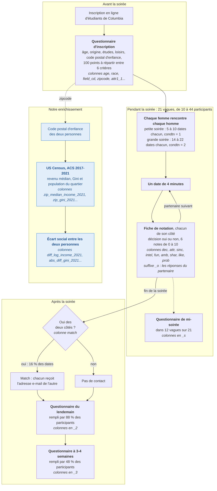
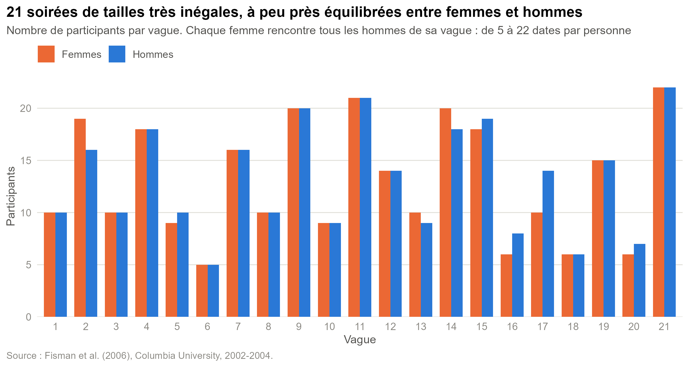
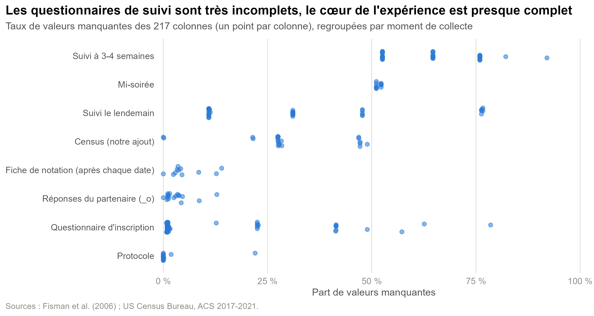
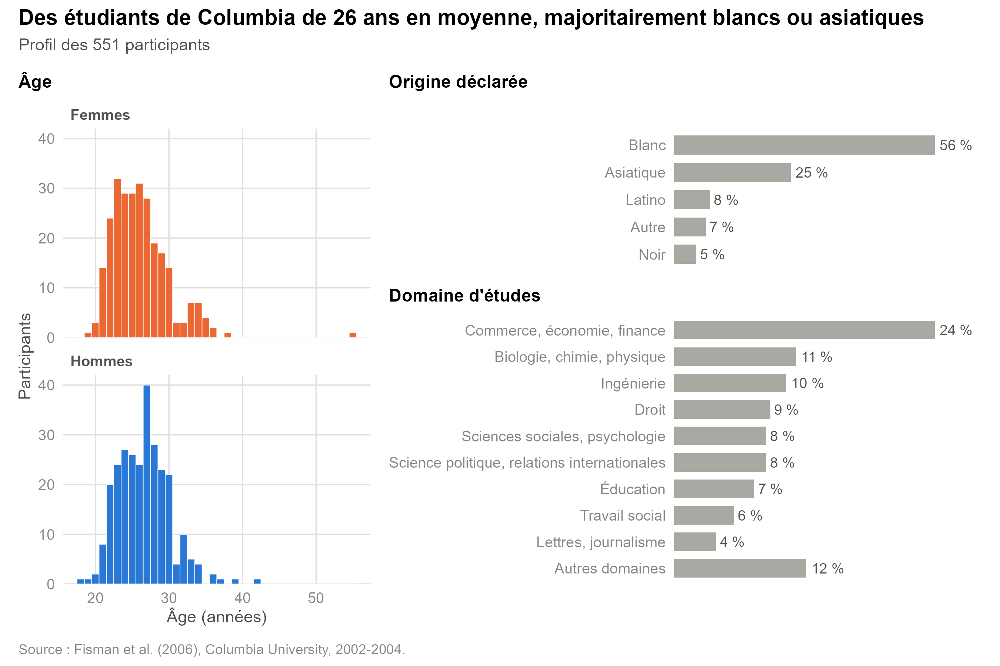
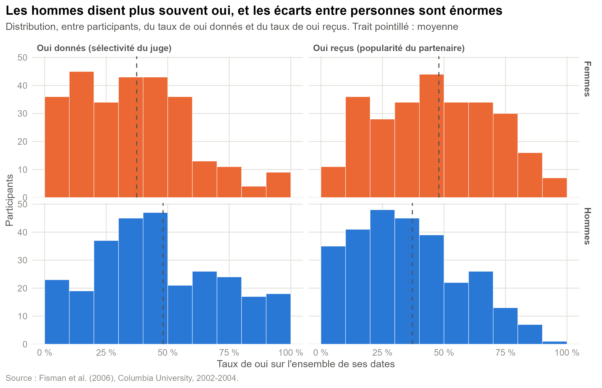
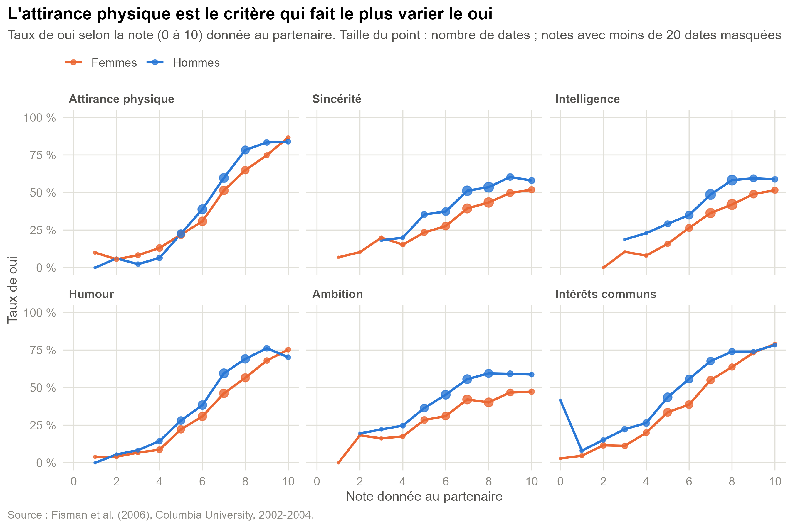
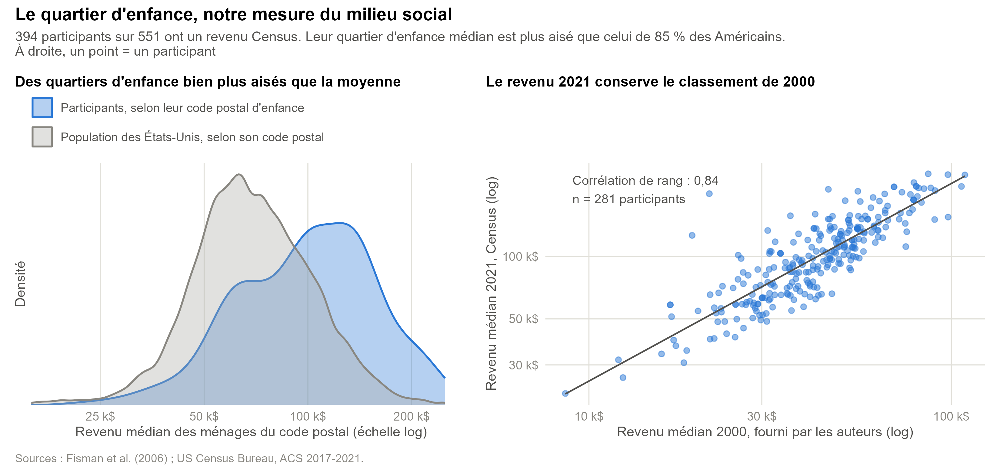
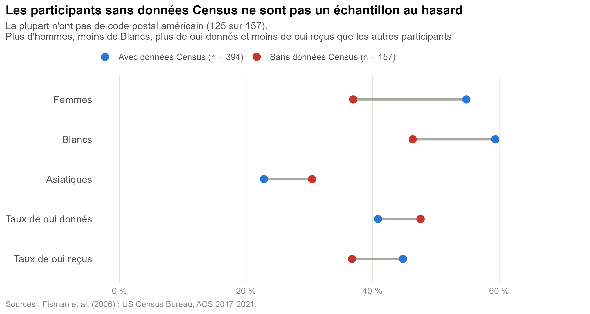
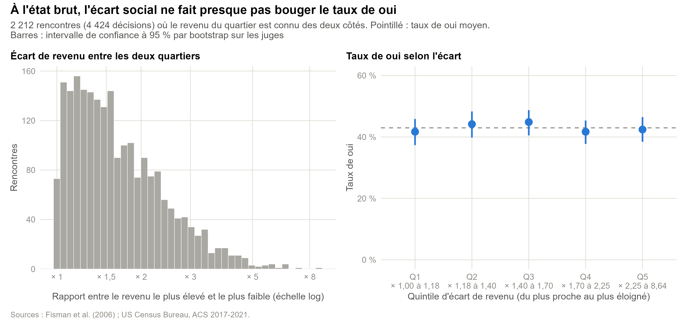

# Exploration du jeu de données Speed Dating × Census

Code : [R/02_exploration.R](R/02_exploration.R). Figures exportées dans `outputs/exploration/`. Pour tout régénérer depuis la racine du dépôt : `Rscript R/02_exploration.R`.

Ce document sert à comprendre le jeu de données avant de s'en servir. Il ne répond pas encore à la problématique : il dit ce que contient la table, ce qui est fiable, ce qui ne l'est pas, et ce que cela impose pour la suite.

## L'expérience en un schéma

Les données viennent de 21 soirées de speed dating organisées par Fisman, Iyengar, Kamenica et Simonson entre 2002 et 2004 pour des étudiants de master, de doctorat et des écoles professionnelles de l'université Columbia. Le schéma suit un participant du début à la fin et indique, à chaque étape, les colonnes du jeu de données qui en sortent.



Trois choses à retenir de ce protocole :

- **Qui rencontre qui ne dépend pas des participants.** À l'intérieur d'une soirée, chaque femme rencontre chaque homme. Personne ne choisit ses partenaires : c'est ce qui rapproche ces données d'une expérience et permet de comparer les choix observés à ce que donnerait le hasard.
- **La décision est prise juste après le date, sans connaître celle de l'autre.** `dec` mesure donc une préférence individuelle, alors que `match` dépend des deux personnes.
- **Plus on s'éloigne de la soirée, moins les participants répondent.** La fiche de notation est remplie sur place par tout le monde, le questionnaire du lendemain par 88 % des participants et celui à trois semaines par 48 %. Le questionnaire de mi-soirée n'a été distribué que dans 12 vagues.

## Import des données

```r
library(tidyverse)
library(patchwork)
source("R/commun.R")   # charte graphique, formats et libellés partagés par les scripts

brut <- read_csv("data/speed_dating_census.csv", show_col_types = FALSE, guess_max = 10000)

dates <- brut |>
  mutate(
    genre = if_else(gender == 0, "Femmes", "Hommes"),
    race_lab = libeller(race, lab_race),
    field_lab = libeller(field_cd, lab_field),
    census = !is.na(zip_median_income_2021),
    abs_diff_log_income = abs(diff_log_income_2021)
  )

# Une ligne par participant : les attributs individuels sont répétés sur chaque date
participants <- dates |> distinct(iid, .keep_all = TRUE)
```

On ne touche jamais aux fichiers de `data/` : tous les recodages sont faits dans le script et listés ci-dessus. Les variables du questionnaire sont codées par des entiers (`gender`, `race`, `field_cd`...), on leur donne des libellés à partir du dictionnaire des auteurs, rangés dans [R/commun.R](R/commun.R) avec la charte graphique commune à tous les scripts. `guess_max = 10000` évite que `read_csv` devine mal le type des colonnes presque vides.

Trois vérifications de structure sont faites dans le script, avec `stopifnot()` : un couple orienté (`iid`, `pid`) n'apparaît qu'une fois, `match` vaut bien `dec × dec_o`, et chaque femme a autant de dates qu'il y a d'hommes dans sa vague.

## Why

### En tant que statisticien, qu'est-ce qui nous intéresse ?

Avant de modéliser, on veut savoir trois choses. Quelle est l'unité statistique et comment les lignes dépendent les unes des autres. Quelles variables sont assez complètes pour être utilisées. Si les variables Census que nous avons ajoutées sont crédibles, et pour quels participants elles manquent.

### Quel phénomène peut intéresser un sociologue ?

L'homogamie : le fait de choisir un partenaire du même milieu que soi. Ici on peut l'observer au moment du choix, puisque chaque participant dit oui ou non à des personnes rencontrées presque au hasard, et que l'on connaît le quartier où chacun a grandi.

### Quelles actions et cibles pour la visualisation ?

On veut **résumer** des distributions (âge, revenu du quartier, taux de oui), **comparer** des groupes (femmes et hommes, participants avec et sans données Census), **explorer des relations** (note donnée et décision, écart social et décision) et **repérer des anomalies** (colonnes vides, valeurs plafonnées, codages incohérents). Ces graphiques sont faits pour nous : ils privilégient la lecture exacte à l'effet visuel.

## What

### Quel type de données et quels items ?

C'est un tableau de 8 378 lignes et 217 colonnes. **Un item est un date orienté** : la personne `iid` rencontre la personne `pid` pendant quatre minutes et décide si elle veut la revoir. Chaque rencontre apparaît donc deux fois, une fois du point de vue de chacun.

Il y a en réalité trois niveaux emboîtés :

| Niveau | Effectif | Identifiant | Ce qui est mesuré à ce niveau |
|---|---|---|---|
| Vague (soirée) | 21 | `wave` | taille de la soirée, condition expérimentale `condtn` |
| Participant | 551 (274 femmes, 277 hommes) | `iid` | âge, origine, études, code postal d'enfance, variables Census |
| Date orienté | 8 378 | `iid` × `pid` | décision `dec`, notes données au partenaire, écarts entre les deux personnes |

### Quels attributs ?

Sur 217 colonnes, une vingtaine suffisent pour notre question.

| Attribut | Type | Valeurs | Rôle |
|---|---|---|---|
| `dec` | catégoriel binaire | 1 = oui, 0 = non | variable réponse (décision de `iid`) |
| `dec_o`, `match` | catégoriel binaire | | décision du partenaire, oui mutuel |
| `gender` | catégoriel | 0 = femme, 1 = homme | |
| `age`, `age_o` | quantitatif | 18 à 55 ans | |
| `race`, `race_o`, `samerace` | catégoriel | 5 modalités | contrôle |
| `field_cd` | catégoriel | 18 domaines d'études | contrôle, proxy de capital culturel |
| `attr`, `sinc`, `intel`, `fun`, `amb`, `shar` | ordonné | note de 0 à 10 | jugement porté sur le partenaire |
| `like`, `prob` | ordonné | note de 0 à 10 | appréciation globale, chance estimée d'être choisi |
| `int_corr` | quantitatif | −1 à 1 | corrélation des centres d'intérêt des deux personnes |
| `zip_median_income_2021` (+ `_o`) | quantitatif | 21 846 à 250 001 $ | milieu social d'origine |
| `zip_gini_2021` (+ `_o`) | quantitatif | 0,24 à 0,68 | inégalités du quartier d'origine |
| `income_2000` | quantitatif | 8 607 à 109 031 $ | même mesure, fournie par les auteurs |
| `diff_log_income_2021`, `abs_diff_gini_2021`... | quantitatif | | **écart social entre les deux personnes** |

Le suffixe `_o` désigne toujours le partenaire. Les colonnes terminées par `_1`, `_s`, `_2`, `_3` viennent de questionnaires remplis à des moments différents (inscription, mi-soirée, lendemain, trois semaines plus tard).

### Quels liens entre attributs ?

Les participants sont **nichés dans les vagues** : on ne rencontre que des personnes de sa soirée. À l'intérieur d'une vague, femmes et hommes sont **croisés** : chaque femme rencontre chaque homme. Une même personne apparaît donc entre 5 et 22 fois comme juge (`iid`) et autant de fois comme partenaire (`pid`) : les lignes ne sont pas indépendantes. Enfin, les variables d'écart (`diff_*`) n'existent que si les **deux** personnes ont des données Census, ce qui élimine beaucoup de lignes.

## How

### Visualisation 1 : la structure de l'expérience



Un diagramme en barres groupées, la vague en abscisse et la couleur pour le genre. Les soirées vont de 10 à 44 participants, toujours à peu près équilibrées entre femmes et hommes. Conséquence directe : le nombre de dates par personne varie de 5 à 22 (médiane 16). Les grandes vagues pèsent beaucoup plus lourd dans la table : la vague 21 fournit 968 lignes, la vague 6 seulement 50. Le taux de oui varie aussi d'une soirée à l'autre (de 34 % à 56 %), ce qui justifie de raisonner à l'intérieur des vagues.

### Visualisation 2 : les données manquantes



Un point par colonne, positionné selon son taux de valeurs manquantes, et les colonnes regroupées par moment de collecte. Les groupes sont triés du plus complet au plus incomplet, pour que la hiérarchie se lise de bas en haut.

Le cœur de l'expérience est presque complet : `dec` n'a aucun manquant, les notes en ont entre 2 % et 4 %, sauf l'ambition (`amb`, 9 %) et les intérêts communs (`shar`, 13 %), plus difficiles à juger en quatre minutes. 84 % des dates ont les six notes renseignées. À l'inverse, les questionnaires de suivi sont inutilisables : le taux médian de manquants est de 31 % pour le suivi du lendemain et de 65 % pour celui à trois semaines. Le questionnaire de mi-soirée manque dans 51 % des lignes, simplement parce qu'il n'a été distribué que dans 12 vagues sur 21. Dans le questionnaire d'inscription, quelques colonnes sont aussi très vides : `expnum` (79 %), `mn_sat` (63 %), `tuition` (57 %), `undergra` (41 %).

Le point important pour nous : **`income`, la mesure du milieu social fournie par les auteurs, manque dans 49 % des lignes**. C'est la raison d'être de notre enrichissement. Avec le Census, le taux de manquants du revenu tombe à 28 %.

Autre piège repéré : `met` (« avez-vous déjà rencontré cette personne ? ») devrait valoir 1 (oui) ou 2 (non), mais près de la moitié des lignes valent 0 et quelques-unes vont jusqu'à 8. On ne l'utilisera pas.

### Visualisation 3 : le profil des participants



Histogrammes pour l'âge, barres horizontales triées pour les variables catégorielles. Les barres sont en gris neutre car aucune modalité n'est à mettre en avant ; la valeur est écrite au bout de la barre, ce qui permet de supprimer l'axe.

Les participants ont 26 ans en moyenne (de 18 à 55 ans, une seule personne au-delà de 42 ans). 56 % se déclarent blancs et 25 % asiatiques. Un quart étudie le commerce, l'économie ou la finance. C'est une population très particulière : des étudiants de master, de doctorat ou d'écoles professionnelles d'une université d'élite. **La sélection sociale a déjà eu lieu avant la soirée**, ce qui réduit mécaniquement les écarts de milieu que l'on pourra observer.

### Visualisation 4 : la variable réponse



Pour chaque participant, on calcule la part de ses dates où il a dit oui (sa sélectivité) et la part où on lui a dit oui (sa popularité). Petits multiples : une colonne par mesure, une ligne par genre, mêmes échelles partout pour comparer directement.

Sur l'ensemble des dates, le taux de oui est de 42 % et le taux de match de 16 %. Les hommes disent oui dans 47 % des cas, les femmes dans 37 %. Mais l'information principale est la **dispersion entre personnes** : l'écart-type du taux de oui individuel est d'environ 25 points. 8 % des femmes n'ont dit oui à personne, 5 % des hommes ont dit oui à tout le monde, et 6,5 % des hommes n'ont reçu aucun oui.

Une grande part de la variabilité de `dec` tient donc à *qui juge* et à *qui est jugé*, avant même de regarder les caractéristiques du couple. C'est l'argument visuel en faveur d'un modèle mixte avec un effet aléatoire pour le juge et un autre pour le partenaire.

### Visualisation 5 : les notes données au partenaire



Un panneau par critère, la note en abscisse, le taux de oui en ordonnée sur une échelle commune de 0 à 100 %. La taille des points rappelle le nombre de dates, et les notes reposant sur moins de 20 dates sont masquées pour ne pas lire du bruit.

L'attirance physique est le critère le plus discriminant : le taux de oui passe de 8 % pour une note de 4 ou moins à 76 % pour une note de 8 ou plus (+68 points). Viennent ensuite l'humour (+58) et les intérêts communs (+54), loin devant l'intelligence (+40), la sincérité (+35) et l'ambition (+31), dont les courbes plafonnent autour de 50 %. Les courbes des hommes sont presque partout au-dessus de celles des femmes : à note égale, ils disent plus souvent oui.

Attention, ces six notes ne sont pas six informations indépendantes. Elles sont corrélées entre elles (de 0,36 à 0,66), signe d'un effet de halo : quelqu'un qui plaît est jugé meilleur sur tout. Il faudra en tenir compte si on les met ensemble dans un modèle. Le point isolé à 42 % pour la note 0 en « intérêts communs » chez les hommes ne repose que sur 24 dates (18 juges) : il ne faut pas le surinterpréter.

### Visualisation 6 : les variables Census



À gauche, deux densités superposées sur une échelle logarithmique : le revenu est une variable asymétrique, et c'est le rapport entre deux revenus qui a du sens, pas leur différence. Pour comparer des personnes à des personnes, chaque code postal américain pèse selon son nombre d'habitants ; sans cette pondération, les petits codes postaux ruraux compteraient autant que les grands codes postaux urbains. L'axe est cadré entre 18 000 et 260 000 $, où se trouve l'essentiel de la distribution. À droite, un nuage de points en échelle log-log avec une droite de régression.

394 participants sur 551 ont un revenu Census. Leurs quartiers d'enfance sont bien plus aisés que ceux où vivent les Américains : le revenu médian y est de 103 000 $, contre 68 000 $ pour la population des États-Unis. Seuls 15 % des Américains vivent dans un code postal plus aisé que le quartier d'enfance médian des participants. La distribution des participants présente un épaulement vers 65 000 $ et un pic vers 130 000 $. Quatre participants viennent de quartiers au plafond du Census (250 001 $, valeur censurée), ce qui explique que leur courbe s'arrête net à droite.

Le graphique de droite valide la mesure : sur les 281 participants qui ont les deux, la corrélation de rang (Spearman) entre le revenu 2021 et le revenu 2000 fourni par les auteurs est de 0,84. Les niveaux ont changé en vingt ans, mais le classement des quartiers est conservé, et c'est lui qui compte pour mesurer un écart. Quelques points au-dessus de la droite sont des quartiers qui se sont fortement enrichis.

### Visualisation 7 : qui perd-on faute de code postal ?



Un graphique en haltères : pour chaque indicateur, un point par groupe sur un axe commun partant de zéro, reliés par un segment dont la longueur donne l'écart. Le groupe sans données est en rouge pour qu'il ressorte.

157 participants n'ont pas de données Census, dont 125 qui n'ont pas renseigné de code postal américain : leur lieu d'origine déclaré est souvent un pays étranger (Inde, Chine, Israël, Espagne...). Ce groupe n'est pas un échantillon au hasard. Il compte 37 % de femmes contre 55 % chez les autres et 46 % de Blancs contre 59 %. Ses membres disent plus souvent oui (48 % contre 41 %) et en reçoivent moins (37 % contre 45 %). Ces quatre écarts sont significatifs au seuil de 1 % (test du khi-deux pour les proportions, test de Student pour les taux de oui). L'écart sur la part d'Asiatiques (31 % contre 23 %) ne l'est pas (p = 0,08).

Le déficit de oui reçus ne s'explique pas seulement par la plus forte proportion d'hommes, qui reçoivent moins de oui que les femmes : il se retrouve à genre égal (41 % contre 50 % chez les femmes, 35 % contre 39 % chez les hommes).

Nos conclusions porteront donc sur les participants **qui ont grandi aux États-Unis**. C'est une limite à annoncer, mais elle est cohérente avec la question : le quartier d'enfance comme marqueur social n'a de sens qu'à l'intérieur d'un même pays.

### Visualisation 8 : l'écart social entre les deux personnes



L'écart est mesuré par `|diff_log_income_2021|`, que l'on relit comme un rapport : « × 2 » veut dire que l'un des deux quartiers a un revenu médian deux fois plus élevé que l'autre. À gauche, l'histogramme de cet écart, avec une ligne par rencontre : les deux lignes d'une même rencontre ont le même écart, les garder toutes les deux compterait chaque rencontre deux fois. À droite, le taux de oui par quintile d'écart, calculé sur les décisions, avec le taux moyen en pointillé comme référence.

Seules 4 424 décisions sur 8 378 (53 %), soit 2 212 rencontres, ont le revenu des deux personnes. L'écart médian est de × 1,5, un quart des rencontres dépassent × 2,1 et le maximum atteint × 8,6 : malgré la sélection sociale de Columbia, il y a de la variabilité à exploiter.

Le premier regard ne montre **aucun gradient** : le taux de oui vaut 42 %, 44 %, 45 %, 42 % et 42 % du quintile le plus proche au plus éloigné. Les barres sont des intervalles de confiance à 95 % obtenus par bootstrap sur les juges : on tire des participants avec remise et on garde toutes leurs décisions, ce qui respecte le fait qu'un même juge décide une quinzaine de fois. Un intervalle binomial classique, qui traiterait chaque ligne comme indépendante, serait trop étroit. Tous les intervalles recouvrent le taux moyen.

Ce graphique ne contrôle rien pour autant : si les personnes issues de quartiers riches étaient à la fois plus éloignées des autres et plus populaires, deux effets pourraient se compenser. C'est le rôle des modèles de le vérifier.

## Perspectives

### Ce que l'exploration impose pour la suite

- **Variable réponse** : `dec`, complète et interprétable comme une préférence individuelle. `match` mélange les préférences des deux personnes.
- **Échantillon d'analyse** : les 4 424 dates où le revenu du quartier est connu des deux côtés, en annonçant que les participants sans code postal américain, pour la plupart ayant grandi à l'étranger, en sont exclus.
- **Mesure de l'écart social** : la valeur absolue de l'écart de log-revenu. Le revenu 2000 des auteurs servira de test de robustesse, sur un échantillon plus petit.
- **Variables à écarter** : les questionnaires de suivi (`_2`, `_3`), `expnum`, `mn_sat`, `tuition`, `undergra` et `met`.
- **Valeurs particulières** : quatre quartiers au plafond de 250 001 $ ; une participante de 55 ans ; les petites vagues (6, 18, 20) qui apportent très peu de lignes.

### Quelles analyses ces visualisations suggèrent-elles ?

Une régression logistique de `dec` sur l'écart social, puis avec des contrôles (`samerace`, écart d'âge, même domaine d'études, `int_corr`), puis avec les notes. La visualisation 4 montre que les décisions d'une même personne se ressemblent beaucoup : il faut un modèle mixte avec un effet aléatoire pour le juge (`iid`) et un pour le partenaire (`pid`), ou au minimum le signaler comme limite d'un `glm` classique.

La visualisation 8 suggère que l'effet brut est faible ou nul. Trois pistes pour aller plus loin que ce constat : regarder l'écart **signé** plutôt qu'absolu (préfère-t-on quelqu'un d'un milieu plus aisé que le sien ?), séparer femmes et hommes, et vérifier si le niveau de revenu du quartier du partenaire joue à lui seul sur sa popularité.

Ces modèles sont présentés dans [modeles.md](modeles.md).
