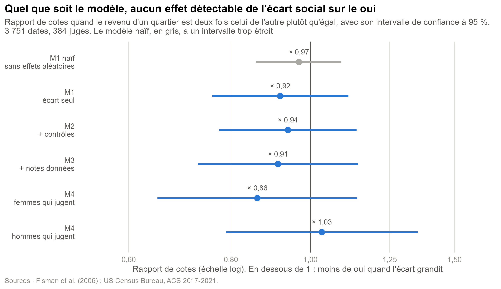
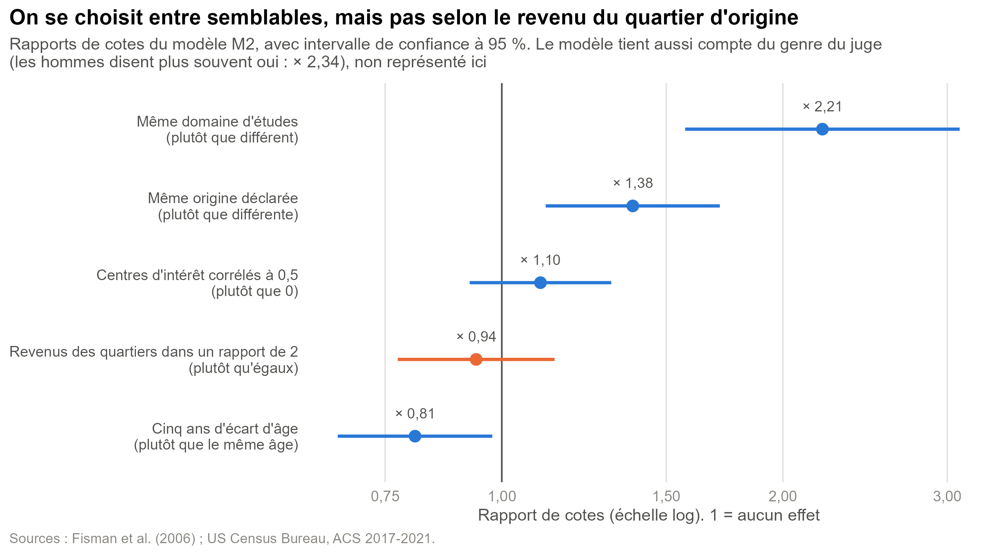
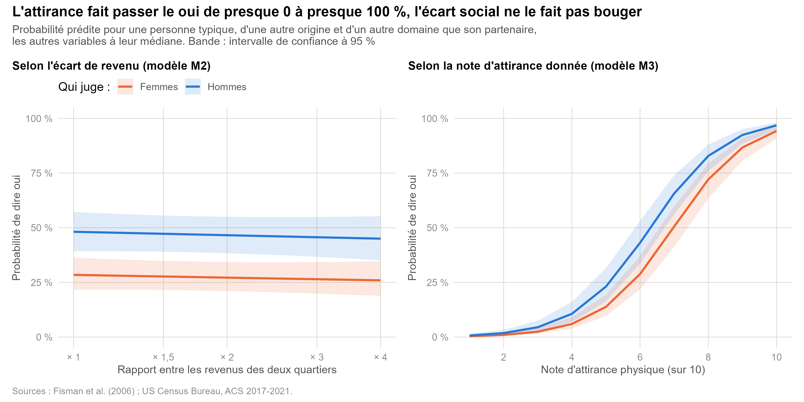
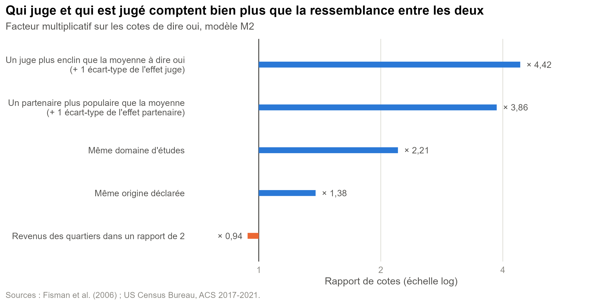

# Modèles : l'écart social change-t-il la probabilité de dire oui ?

Code : [R/04_modeles.R](R/04_modeles.R), à partir du jeu préparé par [R/03_preparation.R](R/03_preparation.R). Figures exportées dans `outputs/modeles/`, résultats numériques dans `outputs/modeles.rds`. Pour tout régénérer depuis la racine du dépôt : `Rscript R/03_preparation.R` puis `Rscript R/04_modeles.R` (environ deux minutes).

L'exploration ([exploration.md](exploration.md)) montrait qu'à l'état brut, le taux de oui ne varie pas avec l'écart de revenu entre les quartiers d'origine. Ce document vérifie si ce constat tient une fois que l'on tient compte de la structure des données et des autres facteurs.

## La question posée au modèle

> Quand deux personnes ont grandi dans des quartiers de niveaux de revenu différents, la probabilité que l'une dise oui à l'autre est-elle plus faible, **toutes choses égales par ailleurs** ?

Si la reproduction sociale passait par le choix du partenaire, on s'attendrait à ce que la réponse soit oui : les gens préféreraient des partenaires de leur milieu.

## Pourquoi ce modèle

### Une régression logistique

La variable réponse `dec` vaut 1 (oui) ou 0 (non). La régression logistique modélise la probabilité de oui. Ses coefficients se lisent en **rapports de cotes** : un rapport de 1 veut dire aucun effet, en dessous de 1 moins de oui, au-dessus plus de oui.

### Avec des effets aléatoires pour le juge et pour le partenaire

L'exploration a montré que les décisions d'une même personne se ressemblent beaucoup : certains disent oui à presque tout le monde, d'autres à presque personne, et certains reçoivent beaucoup plus de oui que d'autres. Chaque personne apparaît une quinzaine de fois comme juge et autant comme partenaire, donc les lignes ne sont pas indépendantes.

Le modèle mixte en tient compte en ajoutant deux termes :

- un **effet juge** (`1 | iid`) : la tendance propre à chaque personne à dire oui ;
- un **effet partenaire** (`1 | pid`) : la popularité propre à chaque personne.

L'effet de l'écart social est alors estimé **à juge et partenaire donnés**, en comparant les décisions d'une même personne envers des partenaires plus ou moins proches d'elle socialement.

### L'écart social mesuré en doublements

L'écart part du rapport entre les revenus médians des deux quartiers, le plus élevé divisé par le plus faible, exprimé en **doublements** (logarithme en base 2 de ce rapport). Un écart de 0 correspond à des revenus égaux, un écart de 1 à un quartier deux fois plus riche que l'autre, un écart de 2 à un quartier quatre fois plus riche. Le rapport de cotes de l'écart compare donc, par exemple, deux personnes dont les quartiers ont des revenus dans un rapport de 2 à deux personnes dont les quartiers ont le même revenu.

## Données

Tous les modèles sont ajustés sur le **même échantillon**, sinon leurs coefficients ne seraient pas comparables : les **3 751 dates** (384 juges) où le revenu du quartier est connu pour les deux personnes et où toutes les variables des modèles sont renseignées. On part des 4 424 dates de l'échantillon d'analyse ; la perte vient surtout de la note d'intérêts communs (`shar`), manquante dans 13 % des cas. Dans cet échantillon, le taux de oui est de 45 %.

## Les modèles emboîtés

On ajoute les variables par blocs, et on regarde comment le coefficient de l'écart social évolue d'un modèle à l'autre.

| Modèle | Variables | Question |
|---|---|---|
| **M1** | écart social | Y a-t-il un effet brut ? |
| **M2** | M1 + genre du juge, même origine déclarée, écart d'âge, même domaine d'études, corrélation des centres d'intérêt | L'effet résiste-t-il aux autres formes de ressemblance ? |
| **M3** | M2 + notes d'attirance, d'humour et d'intérêts communs données au partenaire | L'effet passe-t-il par la façon dont on perçoit l'autre ? |
| **M4** | M2 où l'on sépare l'écart (ressembler à l'autre) du revenu du quartier du partenaire (préférer quelqu'un d'aisé), séparément pour les femmes et les hommes | Homophilie ou préférence pour le statut ? |

```r
M2 <- glmer(
  dec ~ ecart_doublement + homme + samerace + ecart_age + meme_domaine + int_corr +
    (1 | iid) + (1 | pid),
  data = donnees_completes, family = binomial
)
```

On ajuste aussi un **M1 naïf** : la même régression que M1 mais sans effets aléatoires (`glm`), qui fait comme si les 3 751 lignes étaient indépendantes. Il ne sert qu'à montrer l'erreur que l'on ferait.

## Résultats

### Figure 1 : l'effet de l'écart social, modèle par modèle



Un point par modèle, avec son intervalle de confiance à 95 %, sur une échelle logarithmique centrée sur 1 (aucun effet). C'est la figure principale : elle suit un seul coefficient à travers tous les modèles.

**Aucun modèle ne détecte d'effet de l'écart social.** Le rapport de cotes reste entre 0,86 et 1,03, et tous les intervalles contiennent 1 :

| Modèle | Rapport de cotes, revenus dans un rapport de 2 plutôt qu'égaux | IC à 95 % | p |
|---|---|---|---|
| M1 | 0,92 | 0,76 à 1,11 | 0,39 |
| M2 | 0,94 | 0,77 à 1,14 | 0,52 |
| M3 | 0,91 | 0,73 à 1,14 | 0,43 |
| M4, femmes qui jugent | 0,86 | 0,65 à 1,14 | 0,30 |
| M4, hommes qui jugent | 1,03 | 0,79 à 1,35 | 0,81 |

Le coefficient ne bouge presque pas quand on ajoute les contrôles puis les notes : aucun des facteurs ajoutés ne masquait un effet de l'écart, et l'écart n'agit pas non plus à travers l'attirance perçue.

Le M1 naïf illustre pourquoi le modèle mixte est nécessaire : son erreur type est de 0,061 contre 0,098 pour M1. En ignorant la répétition des personnes, on obtiendrait des intervalles environ 40 % plus étroits qu'ils ne devraient, donc une fausse impression de précision.

**Absence d'effet détecté ne veut pas dire effet nul.** L'intervalle de M2 permet de dire ce que l'on peut exclure. Autour du taux de oui moyen de 45 %, passer de revenus égaux à des revenus dans un rapport de 2 correspond à une variation comprise entre −6 et +3 points de pourcentage (estimation centrale : −1,6 point). Un effet fort de l'écart social est donc exclu ; un effet faible, de quelques points, reste possible.

### Figure 2 : l'écart social face aux autres ressemblances



Les effets de ressemblance de M2 sur la même échelle, triés par valeur. Comme les variables n'ont pas les mêmes unités, chaque effet est calculé pour un contraste concret plutôt que « par unité » : même origine plutôt que différente, cinq ans d'écart d'âge plutôt que le même âge, etc. L'écart social est en orange pour le distinguer.

D'autres formes de ressemblance jouent nettement :

| Contraste | Rapport de cotes | IC à 95 % | Lecture |
|---|---|---|---|
| Même domaine d'études, plutôt que différent | 2,21 | 1,57 à 3,09 | les cotes de dire oui doublent |
| Même origine déclarée, plutôt que différente | 1,38 | 1,11 à 1,71 | les cotes augmentent de 38 % |
| Cinq ans d'écart d'âge, plutôt que le même âge | 0,81 | 0,67 à 0,98 | les cotes baissent de 19 % |
| Centres d'intérêt corrélés à 0,5, plutôt que 0 | 1,10 | 0,92 à 1,31 | non significatif |
| Revenus dans un rapport de 2, plutôt qu'égaux | 0,94 | 0,77 à 1,14 | non significatif |

Le genre du juge est aussi dans le modèle mais n'est pas représenté, car ce n'est pas une ressemblance : les hommes ont des cotes 2,3 fois plus élevées de dire oui (IC 1,49 à 3,66), ce que montrait déjà l'exploration.

Il y a donc bien de l'**homophilie** dans ces choix, mais elle porte sur le domaine d'études, l'origine et l'âge, **pas sur le revenu du quartier où l'on a grandi**. Le domaine d'études est intéressant pour la problématique : c'est une dimension du capital culturel au sens de Bourdieu, sans doute plus proche de la position sociale que le revenu d'un quartier.

Dans M3, l'effet du même domaine d'études disparaît (rapport de cotes 0,84, IC 0,57 à 1,24) une fois les notes ajoutées. La ressemblance d'études agit donc à travers la perception de l'autre : on trouve sans doute plus d'intérêts communs, ou plus d'humour, à quelqu'un qui étudie la même chose que soi.

### Figure 3 : ce que cela représente en probabilité



Les rapports de cotes sont difficiles à se représenter. On les traduit en probabilités prédites pour une personne typique (effets juge et partenaire nuls), d'une autre origine et d'un autre domaine que son partenaire, les autres variables à leur médiane. Les deux panneaux ont la même échelle de 0 à 100 %, pour que les pentes soient directement comparables. L'axe de l'écart s'arrête à × 4, ce qui couvre 97,5 % des dates.

À gauche, quand le revenu de l'un des quartiers passe d'égal à quatre fois celui de l'autre, la probabilité de oui passe de 28 % à 26 % pour une femme qui juge et de 48 % à 45 % pour un homme. À droite, quand la note d'attirance passe de 2 à 8, elle passe de 1 % à 72 % pour une femme et de 2 % à 83 % pour un homme. Le contraste résume le résultat : ce qui se passe pendant les quatre minutes compte beaucoup plus que le milieu d'origine.

### Figure 4 : les personnes comptent plus que la paire



On compare l'ampleur de cinq facteurs sur la même échelle. Pour les effets juge et partenaire, on prend un écart-type des effets aléatoires : c'est la différence entre une personne moyenne et une personne au-dessus de la moyenne, sans être un cas extrême (environ une personne sur six est au-delà).

Passer d'un juge moyen à un juge plus enclin à dire oui (un écart-type au-dessus) multiplie les cotes par 4,4. Passer d'un partenaire moyen à un partenaire plus populaire, par 3,9. Ces différences entre individus écrasent tous les effets de la paire, et l'écart social est le plus faible de tous.

Dans M3, l'écart-type de l'effet partenaire tombe de 1,35 à 0,52 : la popularité d'une personne s'explique en grande partie par les notes qu'elle reçoit, et d'abord par son attirance perçue.

### Homophilie ou préférence pour le statut ? (M4)

On pourrait imaginer que l'effet de l'écart soit masqué par une préférence pour les partenaires issus de quartiers aisés. M4 sépare les deux et les estime séparément pour les femmes et les hommes. Aucun des deux n'est détecté :

| Effet | Femmes qui jugent | Hommes qui jugent |
|---|---|---|
| Écart de revenu : rapport de 2 plutôt que revenus égaux | 0,86 (0,65 à 1,14) | 1,03 (0,79 à 1,35) |
| Revenu du quartier du partenaire : deux fois plus élevé | 1,01 (0,68 à 1,48) | 1,09 (0,78 à 1,52) |

Avec le revenu 2021, on ne retrouve pas le résultat de Fisman et al. (2006), selon lequel les femmes préfèrent les hommes qui ont grandi dans des quartiers aisés. Les auteurs utilisaient le revenu 2000 et un modèle différent : le test de robustesse devra refaire M4 avec cette mesure avant de conclure à une divergence.

## Réponse provisoire à la problématique

**Dans cette expérience, le choix du partenaire ne suit pas le milieu social d'origine mesuré par le revenu du quartier.** On ne détecte ni préférence pour ceux qui ont grandi dans un quartier semblable au sien, ni préférence pour ceux qui viennent d'un quartier aisé. En revanche, les participants choisissent davantage des partenaires du même domaine d'études, de la même origine et d'un âge proche.

Cela ne veut pas dire que la reproduction sociale est absente. Tous les participants sont étudiants à Columbia : la sélection sociale a eu lieu **avant la soirée**, à l'entrée dans l'université. Une fois dans ce milieu, les écarts d'origine qui subsistent ne pèsent plus sur le choix, alors que les ressemblances de parcours (le domaine d'études) pèsent encore. C'est cohérent avec l'idée, classique en sociologie de la famille, que l'homogamie se fait d'abord par les lieux de rencontre plutôt que par les préférences individuelles.

## Limites

- **Absence de preuve n'est pas preuve d'absence.** Les intervalles excluent un effet fort, pas un effet de quelques points.
- **La mesure du milieu social est bruitée.** Le revenu médian du quartier en 2021 n'est pas le revenu de la famille pendant l'enfance. Une mesure bruitée tire mécaniquement les coefficients vers zéro (biais d'atténuation) : un vrai effet modéré pourrait apparaître comme nul.
- **La population est très homogène.** Des quartiers d'origine déjà aisés laissent peu de variation à exploiter.
- **L'échantillon exclut les 157 participants sans données Census** sur 551, pour la plupart sans code postal américain, qui ne sont pas un sous-groupe au hasard (voir l'exploration).
- **Les deux décisions d'une même rencontre ne sont pas indépendantes** : une attirance réciproque peut exister au-delà de ce qu'expliquent les effets juge et partenaire. Le modèle ne l'intègre pas.
- **Les probabilités de la figure 3 concernent une personne typique**, pas la moyenne de la population. Les intervalles de confiance sont des intervalles de Wald.

## Suite

Le script `R/05_robustesse.R` refera M2 et M4 avec d'autres mesures et d'autres échantillons, pour vérifier que la conclusion ne tient pas à un choix particulier :

- le revenu 2000 fourni par les auteurs à la place du revenu 2021 ;
- l'échantillon sans quartiers plafonnés ni quartiers à forte marge d'erreur (4 128 dates) ;
- l'écart de Gini à la place de l'écart de revenu ;
- le fait d'appartenir au même tercile de revenu plutôt qu'un écart continu.

Les résultats de `outputs/modeles.rds` (coefficients, matrices de variance, prédictions) sont prêts à être chargés par l'application Shiny, sans réajuster les modèles.
