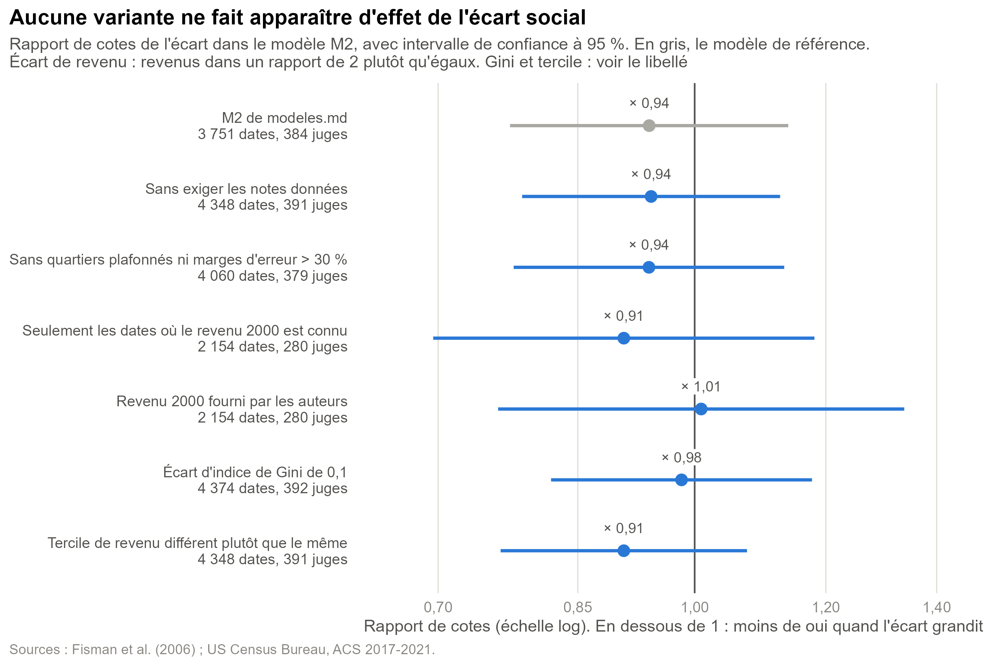
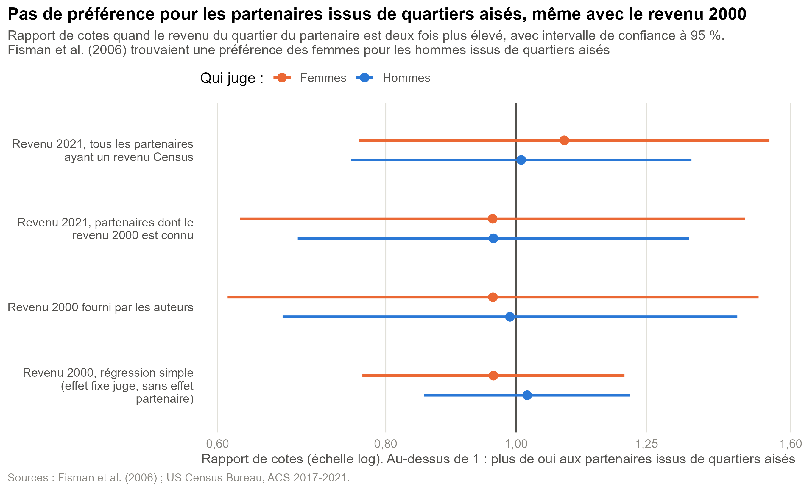

# Robustesse : la conclusion tient-elle à un choix de l'analyse ?

Code : [R/05_robustesse.R](R/05_robustesse.R), à partir de `outputs/dates.rds` et `outputs/modeles.rds`. Figures exportées dans `outputs/robustesse/`, résultats numériques dans `outputs/robustesse.rds`. Pour régénérer depuis la racine du dépôt, après les scripts 03 et 04 : `Rscript R/05_robustesse.R` (environ deux minutes).

Les modèles ([modeles.md](modeles.md)) ne détectent aucun effet de l'écart de revenu entre les quartiers d'origine sur la probabilité de dire oui. Ce document vérifie que cette conclusion ne dépend pas d'un choix particulier de l'analyse.

## Pourquoi ces vérifications

Chaque étape de l'analyse repose sur un choix qui aurait pu être fait autrement : quel échantillon garder, quelle mesure du revenu utiliser, sous quelle forme mesurer l'écart. Si la conclusion ne tenait qu'à l'un de ces choix, elle serait fragile.

Le principe est simple : on repart du modèle M2 de [modeles.md](modeles.md) (écart social, contrôles, effets juge et partenaire) et chaque variante ne change **qu'une seule chose**. Si le résultat change, on sait ce qui l'a fait changer.

On teste aussi directement le résultat de Fisman et al. (2006), que les modèles ne retrouvaient pas avec le revenu 2021 : les femmes préféreraient les hommes qui ont grandi dans des quartiers aisés.

## Les variantes

| Variante | Ce qui change | Pourquoi |
|---|---|---|
| Sans exiger les notes données | On garde les 597 dates où une note manque, puisque M2 n'utilise pas les notes | La référence les écartait pour être comparable à M3 : on vérifie que cette perte ne biaise rien |
| Sans quartiers plafonnés ni marges d'erreur > 30 % | On retire les dates où l'un des quartiers est plafonné à 250 001 $ (4 participants) ou a une marge d'erreur supérieure à 30 % de son revenu (8 participants) | Ces mesures sont les moins fiables |
| Seulement les dates où le revenu 2000 est connu | Échantillon réduit à 2 154 dates | Même échantillon que la variante suivante, pour séparer l'effet de la mesure de celui de l'échantillon |
| Revenu 2000 fourni par les auteurs | L'écart est calculé avec le revenu 2000 au lieu du revenu 2021 | Mesure plus proche de l'enfance des participants, et celle qu'utilisaient Fisman et al. |
| Écart d'indice de Gini de 0,1 | L'écart porte sur les inégalités du quartier et non sur sa richesse | Une autre dimension du milieu, presque indépendante de la première : la corrélation entre les deux écarts est de 0,01 |
| Tercile de revenu différent plutôt que le même | On ne mesure plus une distance mais l'appartenance au même groupe (modeste, intermédiaire, aisé) | Une préférence pour « son » milieu pourrait fonctionner par seuils plutôt que de façon continue |

Un écart de Gini de 0,1 est proche du troisième quartile : 27 % des rencontres dépassent cet écart. La variable tercile est codée « tercile différent » pour que l'homophilie donne, comme les écarts, un rapport de cotes inférieur à 1.

## Résultats

### Figure 1 : l'écart social mesuré autrement

Même lecture que la figure principale des modèles : un point par variante avec son intervalle de confiance à 95 %, sur une échelle logarithmique centrée sur 1 (aucun effet). Le modèle de référence est en gris. Chaque libellé rappelle l'effectif, car les variantes ne portent pas sur les mêmes dates.

| Variante | Dates | Juges | Rapport de cotes | IC à 95 % | p |
|---|---|---|---|---|---|
| M2 de référence | 3 751 | 384 | 0,94 | 0,77 à 1,14 | 0,52 |
| Sans exiger les notes données | 4 348 | 391 | 0,94 | 0,79 à 1,13 | 0,51 |
| Sans quartiers plafonnés ni marges d'erreur > 30 % | 4 060 | 379 | 0,94 | 0,78 à 1,13 | 0,51 |
| Seulement les dates où le revenu 2000 est connu | 2 154 | 280 | 0,91 | 0,70 à 1,18 | 0,47 |
| Revenu 2000 fourni par les auteurs | 2 154 | 280 | 1,01 | 0,76 à 1,34 | 0,95 |
| Écart d'indice de Gini de 0,1 | 4 374 | 392 | 0,98 | 0,82 à 1,18 | 0,84 |
| Tercile de revenu différent plutôt que le même | 4 348 | 391 | 0,91 | 0,76 à 1,08 | 0,26 |

**Aucune variante ne fait apparaître d'effet.** Les rapports de cotes restent entre 0,91 et 1,01, et tous les intervalles contiennent 1.

- Les trois premières variantes donnent exactement le même rapport de cotes que la référence (0,94) : ni la perte des dates sans notes ni les quartiers mal mesurés ne pesaient sur le résultat.
- Sur le même échantillon de 2 154 dates, passer du revenu 2021 au revenu 2000 fait passer le rapport de cotes de 0,91 à 1,01 : avec la mesure des auteurs, l'estimation est encore plus proche de l'absence d'effet. Les intervalles sont plus larges parce que l'échantillon est deux fois plus petit.
- Les inégalités du quartier (Gini) ne jouent pas plus que sa richesse.
- Le fait d'être d'un tercile différent est la variante la plus proche d'un effet (0,91), mais reste loin d'être significative (p = 0,26).

### Figure 2 : une préférence pour les partenaires issus de quartiers aisés ?

On ne regarde plus l'écart entre les deux personnes, mais le revenu du quartier du partenaire seul. Un point par genre du juge, sur la même échelle : un rapport de cotes supérieur à 1 voudrait dire que l'on dit plus souvent oui aux partenaires issus de quartiers aisés. Seul le revenu du partenaire est nécessaire ici : les juges sans données Census sont donc gardés (524 juges au lieu de 384 à 392).

| Spécification | Dates | Femmes qui jugent | Hommes qui jugent |
|---|---|---|---|
| Revenu 2021, tous les partenaires ayant un revenu Census | 5 920 | 1,09 (0,76 à 1,54) | 1,01 (0,75 à 1,35) |
| Revenu 2021, partenaires dont le revenu 2000 est connu | 4 203 | 0,96 (0,62 à 1,48) | 0,96 (0,69 à 1,35) |
| Revenu 2000 fourni par les auteurs | 4 203 | 0,96 (0,61 à 1,51) | 0,99 (0,67 à 1,46) |
| Revenu 2000, régression simple (effet fixe juge, sans effet partenaire) | 1 734 / 2 469 | 0,96 (0,77 à 1,20) | 1,02 (0,85 à 1,22) |

Rapports de cotes quand le revenu du quartier du partenaire est deux fois plus élevé, avec leur intervalle de confiance à 95 %.

**Même avec le revenu 2000, on ne retrouve pas de préférence des femmes pour les hommes issus de quartiers aisés** : le rapport de cotes est de 0,96, et de 0,99 pour les hommes.

La dernière ligne vérifie que ce résultat ne tient pas à notre modèle mixte. Une régression logistique plus simple, avec un effet fixe par juge et sans effet partenaire, donne la même conclusion. Cette régression a pourtant des intervalles un peu trop étroits, puisqu'elle ignore que chaque partenaire revient plusieurs fois : elle aurait donc plutôt tendance à trouver un effet qui n'existe pas.

Nous n'avons pas reproduit à l'identique l'analyse de l'article (sélection des vagues, variables de contrôle, forme exacte du modèle), ce qui peut expliquer la différence. Dans nos données et avec ces spécifications, l'effet n'apparaît pas.

## Conclusion

La conclusion de [modeles.md](modeles.md) tient. **Aucun effet de l'écart social n'apparaît**, quel que soit l'échantillon, la mesure du revenu (2021 ou 2000) ou la forme de l'écart (distance de revenu, distance d'inégalités, appartenance au même tercile). **Aucune préférence pour les partenaires issus de quartiers aisés n'apparaît non plus**, même avec la mesure des auteurs et une spécification plus simple.

## Limites

- **Ces vérifications changent un choix à la fois.** Elles ne corrigent pas les limites de fond de l'analyse : le quartier n'est pas la famille, et la population de Columbia est déjà très sélectionnée.
- **Les variantes avec le revenu 2000 portent sur des échantillons plus petits.** Leurs intervalles sont plus larges : pour les femmes, le rapport de cotes du revenu du partenaire va de 0,61 à 1,51, ce qui n'exclut pas un effet modéré dans un sens ou dans l'autre.
- **La régression simple ignore la répétition des partenaires**, ses intervalles sont donc un peu trop étroits.
